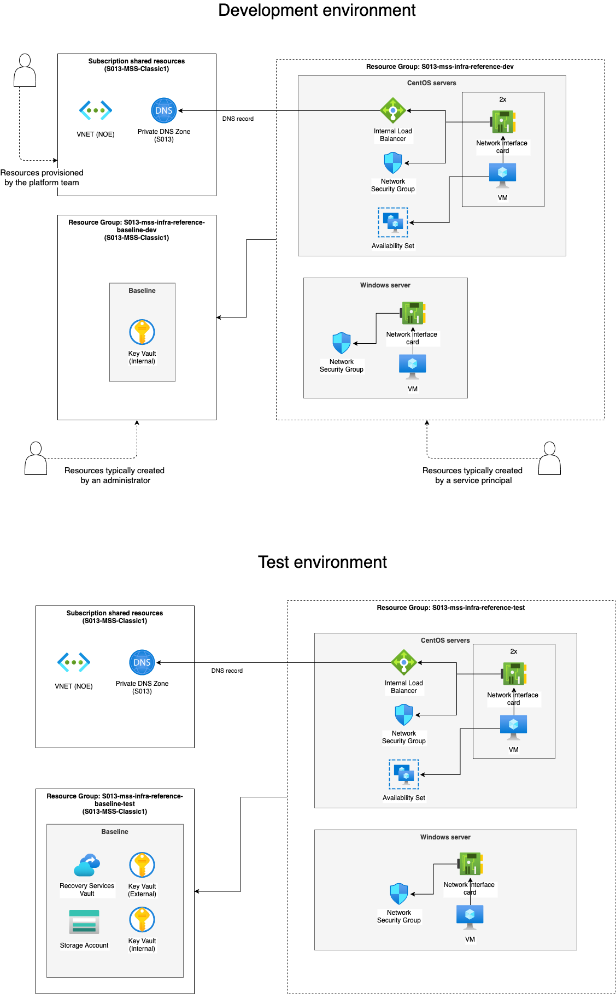

<<<<<<< HEAD


# Note

> This repo is no longer maintained and therefore archived. May be re-opened if needed.


## Purpose 

This repository is intended to be used as a template for getting started quickly with a deployment pipeline in Omnia Classic.

It shows:
  1. How an application can be set up in a Omnia subscription with a deployment pipeline. 
  2. How an application can manage secrets during deployments and operations
  3. [How schedule jobs at certain times/intervals](https://github.com/equinor/mss-infra-reference-classic/blob/master/.github/workflows/cleanup.yml)
  4. How git branches can be linked to different environments in Azure (dev, test, etc)
  5. How VM backups can be set up (optional)

## Assumptions

You already have: 
  - Owner / Omnia Owner rights to a dev and test resource group in a subscription that will be the target of the deployments
  - onboarded as an Equinor developer and have applied for the APPLICATION DEVELOPER role in Access IT, which lets you create service principals
  - a bash shell (locally or e.g. [Cloud Shell](https://azure.microsoft.com/en-us/features/cloud-shell)) to run the supplied scripts
  - installed the [az cli](https://docs.microsoft.com/en-us/cli/azure/install-azure-cli?view=azure-cli-latest)
  - an application baseline resource group (optional for the backup part). See diagram below 

## Notes on security
 
 - It's recommended to use separate service principals for each environment
 - Separating the Key Vault to a resource group where the SP does not have full access can be a good idea
 - Be aware that anyone with WRITE access to this (your) repo can retrieve the service principal credentials
 - One way to protect your production repo (and its GitHub secrets) is to use forking, instead of branches for development and testing 

## Steps

### Create a repository

Create a copy of this repo by pressing the "Use this template" button on the Code tab of this repository.
It's a good idea to initially create the repo as ```Private``` in order to avoid the organization to be added as watchers.
After the repo is created, change it to ```Internal```. 

### Mapping between branches and Omnia Classic environments

The mapping in this project is just an example, which should be modified for your needs. 
Currently the mapping is:

| Branch   | Config           | Resource Groups*** (env)     | Service Principal        |
|----------|------------------|--------------------------|--------------------------|
| dev      | /config/dev.cfg  | S013-mss-infra-reference-dev,<br> S013-mss-infra-reference-baseline-dev  | http://mss-reference-sp  |
| test     | /config/test.cfg | S013-mss-infra-reference-test,<br> S013-mss-infra-reference-baseline-test | http://mss-reference-sp* |
| master** | N/A              | N/A                      | N/A                      |

\*) For simplicity, the same SP is used both for dev and test. This might not be advisable in all cases, and definitely not for a production environment.
<br>\**) master would be mapped to a production environment, but that is ommitted in this application-template
<br>\***) the application is split over two resource groups based on the resource lifecycle. E.g. Key Vaults and Recovery Services Vaults have a longer lifespan than the VMs and are therefore placed in a separate resource group.

Note that the choice of master mapped to production might be opposite of what typically would be done in
a product development repository. The reason is that there always will just be one version in production, unlike products that may have multiple versions in "production" at the same time. 

### Modify the configuration and ARM template parameters

Under [config/dev.cfg](https://github.com/equinor/mss-infra-reference-classic/blob/master/config/dev.cfg) you will find the configuration required to do the development deployment, which is two linux VMs with a load balancer in front, where the load balancer is registered in the Private DNS Zone of the subscription.

The ARM template(s) are located under the ```templates``` folder. 

### Create the service principal

[Activate the APPLICATION DEVELOPER role](https://portal.azure.com/#blade/Microsoft_Azure_PIMCommon/ActivationMenuBlade/aadroles) in PIM

Run the ```scripts/create-sp.sh``` to create the service principal (Warning: if the SP already exists, the create-sp.sh script will reset the SP password)

Add the output as a GitHub repository secret called AZURE_CREDENTIALS, so this can be picked up by the Azure Login action. See [Azure Login Action](https://github.com/Azure/login) for more details on the AZURE_CREDENTIALS

Important:
> Request that the subscription administrator give the service principal the role 
> "Virtual Machine Contributor" on the VNETs it will deploy VMs to

> If the service principal will do manual DNS registrations for e.g. Internal Load Balancers, it need 
> "Omnia Contributor" on the Private DNS Zone as well. 

> Also, the service principal needs Omnia Contributor of the RG containing the Recovery Services vault. 

Unfortunately, there's not yet a good way to fully automate the last two steps.

### Run the deployment script

Log in as the service principal

E.g:

```az login --service-principal -p <password> -u <sp_name> --tenant 3aa4a235-b6e2-48d5-9195-7fcf05b459b0```

Set the environment you want to deploy to as an environment variable. 
The value should match the first part of the .cfg file under /config
E.g.

To deploy the development environment:

```
export ENV=dev
scripts/deploy.sh
```

To deploy the test environment:

```
export ENV=test
scripts/deploy.sh
```

Other environments can be added following the same structure. 


By default the script will:
* Create a KeyVault
* Give the service principal the minimum required access rights to the Key Vault content
* Deploy the ARM template(s) under the templates folder

The scripts, run by the service principal, are only creating resources in the ```S013-mss-infra-reference-dev``` and ```S013-mss-infra-reference-test``` resource groups. 
Backups for the test environment are kept in the ```S013-mss-infra-reference-test``` resource group, which the service principal does not (and should not) have access to. This resource group also contains secrets that are created outside CD pipeline, such as the service principal credentials. 

### Enabling Backup

The setup proposed in this document shows that VM backups are optional. A valid alternative strategy to VM backups are rebuilding the VMs from scratch.
This is especially relevant for stateless VMs. But if you decide to use VM backups, how do you actually enable it?

* If you have a large number of VMs, consider doing it policy based as [outlined here](https://docs.microsoft.com/en-us/azure/backup/backup-azure-auto-enable-backup)
* If you just have a handful of VMs, consider doing it via IaC as [outlined here](https://github.com/equinor/mss-infra-templates/tree/master/classic/enable-vm-backup) or via the Azure Portal

### Diagram of what is deployed


=======
# Getting Started

Welcome to your new project.

It contains these folders and files, following our recommended project layout:

File or Folder | Purpose
---------|----------
`app/` | content for UI frontends goes here
`db/` | your domain models and data go here
`srv/` | your service models and code go here
`package.json` | project metadata and configuration
`readme.md` | this getting started guide


## Next Steps

- Open a new terminal and run `cds watch`
- (in VS Code simply choose _**Terminal** > Run Task > cds watch_)
- Start adding content, for example, a [db/schema.cds](db/schema.cds).


## Learn More

Learn more at https://cap.cloud.sap/docs/get-started/.
>>>>>>> e7a1ebd (Swift GPI Tracker)
